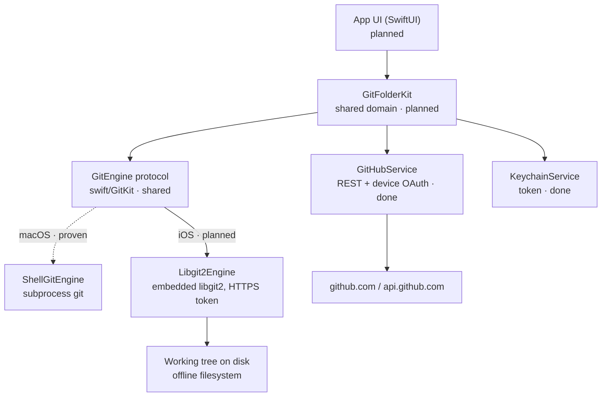

# GitFolder iOS — Architecture (Planned)

**Status: Planned.** No iOS code exists yet. This describes the intended architecture and
marks clearly which parts are **proven**, **in progress**, or **planned**. Sources:
`Projects/GitKit/Gitfolder/plans/ios-app-plan.md` (Section 9),
`GitKanban/plan/platforms-and-git.md`, `swift/GitKit/README.md`, and the spike in
`spikes/libgit2-ios/`.

## Guiding principle

The app layer is **platform-agnostic**. The UI never touches git or files directly — it
goes through the shared `GitEngine` protocol (and, later, `MarkdownStore`). That single
boundary is what lets the same domain/UI logic run on macOS shell-git and iOS libgit2
unchanged. The only platform-specific piece is the concrete `GitEngine` implementation.

## Layering

```
┌──────────────────────────────────────────────────────────────┐
│  App UI (SwiftUI)                                              │  planned
│  Repositories · File Browser · Markdown Editor · Settings      │
└───────────────┬──────────────────────────────────────────────┘
                │ @Observable AppModel / Stores
┌───────────────▼──────────────────────────────────────────────┐
│  Shared domain — GitFolderKit (Swift package)                  │  planned (GITFOLDER-029)
│  SyncedFolder · GitFolderConfig · AppSettings · SyncStatus     │
│  UserFacingError · config (de)serialization · URL normalize    │
└───────┬───────────────────────────┬──────────────────────────┘
        │                           │
┌───────▼───────────────┐  ┌────────▼─────────────┐  ┌────────────────────┐
│ GitEngine (protocol)   │  │ GitHubService        │  │ KeychainService    │
│ swift/GitKit — SHARED  │  │ REST + device OAuth  │  │ token storage      │
│ clone/pullRebase/      │  │ (Foundation-only,    │  │ (shared, ✅ done)   │
│ commit/push/status/    │  │ shared, ✅ done)      │  └────────────────────┘
│ fileHistory            │  └──────────┬───────────┘
└───────┬────────────────┘             │
        │ conforms                     ▼
┌───────▼────────────────┐        github.com / api.github.com
│ Libgit2Engine (iOS)    │  planned — spike proves it (GITFOLDER-028)
│ embedded libgit2,      │
│ HTTPS token auth       │
└───────┬────────────────┘
        ▼
   Working tree on disk  (Application Support/Repos/<id>/)  — offline-capable filesystem
```

On macOS the same `GitEngine` protocol is satisfied by `ShellGitEngine` (subprocess
`git`, **proven**). On iOS it is satisfied by `Libgit2Engine` (embedded libgit2,
**planned**). The layers above the protocol do not change between platforms.



## Component status

| Component | Layer | Platform | Status |
|---|---|---|---|
| `GitEngine` protocol | engine boundary | shared | Exists in `swift/GitKit` |
| `ShellGitEngine` | engine impl | macOS | Proven (ported from `GitRunner`, tested) |
| `Libgit2Engine` | engine impl | iOS | **Planned** — spike must prove transport |
| `KeychainService` | secrets | shared | Done |
| `GitHubOAuthService` | auth | shared | Done (device flow, Foundation-only) |
| `GitFolderKit` (models/config) | domain | shared | **Planned** (GITFOLDER-029) |
| SwiftUI app / stores | UI | iOS | **Planned** |
| File Provider extension | OS integration | iOS | **Planned** v1.1 |

## The open transport question (what the spike answers)

The entire iOS engine hinges on one unproven capability: **authenticated git over HTTPS
via embedded libgit2 on a device.** The Phase 0 spike (`spikes/libgit2-ios/`,
GITFOLDER-028) exists solely to answer it, with these acceptance points:

- The package builds for an **iOS** target (device + simulator arch); note binary size.
- **clone** a private repo over HTTPS with a token.
- **commit** a local edit.
- **pull-rebase** integrates remote changes and, on conflict, **aborts to a clean tree**
  (never mid-rebase) — see Decisions #5.
- **push** over HTTPS with the token — historically the weakest wrapper area and the
  make-or-break result.
- Record whether **SwiftGit2** suffices or the engine must use the **libgit2 C API**
  (Decisions #2).

Until the spike passes, `Libgit2Engine` is a scaffold: its `clone`/`commitAll` sketch
SwiftGit2 calls, while `pullRebase` and `push` throw `notImplemented` on purpose because
those are exactly the capabilities to prove on hardware rather than guess.

## Auth & secrets

- OAuth **device flow** → token in **Keychain**
  (`kSecAttrAccessibleAfterFirstUnlockThisDeviceOnly`), never in `config.json`. Reused
  verbatim from macOS.
- HTTPS git auth via a libgit2 **credential callback** returning
  `x-access-token:<token>` (GitHub's token-over-HTTPS convention).
- No SSH on iOS (no ssh-agent, no `~/.ssh`); HTTPS-over-libgit2 is the only transport.

## Storage & platform

- Clones live in the app container (`Application Support/Repos/<id>/`) — a real
  offline-capable filesystem browsed via `FileManager`.
- Min iOS **17** (SwiftUI `@Observable`, modern BackgroundTasks, File Provider replicated
  extension) — confirm against the chosen libgit2 wrapper's support.
- Background sync via `BGAppRefreshTask`/`BGProcessingTask` (opportunistic, never
  guaranteed); commit-on-background in a short `beginBackgroundTask` window.
- App group shares the repo container + Keychain with the v1.1 File Provider extension.
- `PrivacyInfo.xcprivacy` required (Keychain/UserDefaults reasons; no tracking).

## What is deliberately NOT here

No second git abstraction (the iOS engine conforms to the shared `GitEngine`), no
GitFolder cloud, no server relay, and no separate hand-copied iOS model layer — the
domain is shared through `GitFolderKit`.
