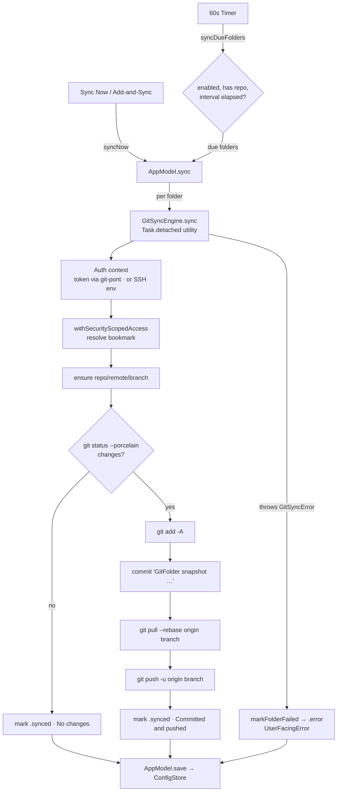

# GitFolder (macOS) — Architecture

How the GitFolder macOS app is built. Scope: the shipping SwiftUI/AppKit target
under `apps/gitfolder-macos/GitFolder/` and its dependency on the shared
`swift/GitKit` package. Reflects the current source, not the aspirational
`docs/`/`packages/core` model.

## Layering at a glance

```
Views (SwiftUI/AppKit)          MenuBarView, SettingsView (+ sub-views)
        │  read state / call intents
        ▼
AppModel  (@MainActor @Observable)   single UI-facing state object
        │  injects & orchestrates
        ▼
Services                        ConfigStore · FolderAccessService · GitRunner
                                GitSyncEngine · LoginItemService
        │  depends on
        ▼
swift/GitKit (SwiftPM)          KeychainService · GitHubOAuthService
git-pont (SwiftPM)              GitPontCore / GitPontGitCLI (credential context)
system git / ssh (subprocess)
```

Dependency direction is one-way: Views → `AppModel` → Services → packages.
Domain/services are UI-agnostic (per root `AGENTS.md`), so the same model layer
can back a future iOS app.

## Entry point

- **`GitFolderApp`** (`@main`) declares two SwiftUI scenes:
  - `MenuBarExtra { MenuBarView }` with `.menuBarExtraStyle(.menu)` and a
    template menu-bar icon — the primary surface.
  - `Settings { SettingsView }` — the preferences window (also used to host the
    Add-folder sheet and per-folder editor).
- Both scenes receive the shared `AppModel` via `.environment(...)`.
- On init/appear the app calls `loadIfNeeded()` (idempotent config load) and,
  once, `requestLaunchAtLoginIfNeeded()` (first-run "open at login?" prompt).

## AppModel — the coordinator

`AppModel` (`@MainActor @Observable`) is the single source of UI state and the hub
for all intents. It holds observable state (`config`, `isSyncing`, `lastMessage`,
`hasGitHubToken`, `gitHubLogin`, sheet/focus flags) and, as `@ObservationIgnored`
collaborators injected through `init` (all defaulted, so tests can substitute
fakes):

| Collaborator | Responsibility | Source |
|---|---|---|
| `ConfigStore` | Load/save `config.json` | inline (`Services/`) |
| `GitSyncEngine` | Run the per-folder sync pipeline | inline (`Services/`) |
| `KeychainService` | Store/load the GitHub token | **GitKit** |
| `GitHubOAuthService` | Device-flow OAuth + viewer login | **GitKit** |
| `LoginItemManaging` (`LoginItemService`) | `SMAppService` login item | inline |
| `UserDefaults` | First-run prompt flag | standard |
| `Timer` (`scheduler`) | 60-second due-folder tick | Foundation |

Responsibilities concentrated here: config persistence orchestration, the
scheduler, GitHub OAuth orchestration, folder CRUD, the sync loop, and
success/failure/changed tallying. It is fully injectable but currently has **no
direct unit tests** (ARC-0008, TEST-0004).

## Services

- **`ConfigStore`** — encodes/decodes `GitFolderConfig` as pretty, sorted-keys,
  ISO-8601 JSON at `~/Library/Application Support/GitFolder/config.json`. Writes
  are atomic; loads guard `schemaVersion == 1` and back up an invalid file to
  `config.invalid.<epoch>.json` before throwing. No migration engine yet.

- **`FolderAccessService`** — `NSOpenPanel` folder/SSH-key pickers; creates and
  resolves **security-scoped bookmarks**; `withSecurityScopedAccess(for:)` wraps
  an operation in paired `start/stopAccessingSecurityScopedResource()`. This is
  how the sandboxed app reaches user-selected folders after relaunch.

- **`GitRunner`** (conforms to `GitRunning`) — launches the system `git` binary
  via `Process` with an **argv array** (no shell), a working directory, a merged
  environment, captured stdout/stderr, and a busy-poll timeout. Resolves `git`
  from a hardcoded candidate list (CommandLineTools, Xcode, `/usr/local`,
  `/opt/homebrew`, fallback `/usr/bin/git`). The `GitRunning` protocol is the
  main test seam (`FakeGitRunner`).

- **`GitSyncEngine`** — the sync state machine (see below). Runs off the main
  thread via `Task.detached(.utility)`, takes an injected `now` closure for
  deterministic tests, and builds a `GitAuthContext` (token via `git-pont`, or
  `GIT_SSH_COMMAND` for SSH). Owns `GitSyncError` → `UserFacingError` mapping.

- **`LoginItemService`** — thin `SMAppService.mainApp` register/unregister +
  status, behind the `LoginItemManaging` protocol.

## Models

- **`GitFolderConfig`** — `schemaVersion`, `AppSettings`, `[SyncedFolder]`.
- **`AppSettings`** — launch-at-login, pause-all, default interval/branch, Git
  author name/email, SSH key path/bookmark, notification prefs, log retention.
  (Some fields — SSH, notifications, log retention — are persisted but not yet
  consumed by any feature.)
- **`SyncedFolder`** — id, name, local path, bookmark, repo URL, provider
  (`github`), `authMode` (`github_token` | `ssh`), branch, interval, enabled,
  timestamps, `lastStatus` (`SyncStatus`), `lastError` (`UserFacingError`). Also
  hosts repo-URL → web-URL normalization (SSH/scp-like → `https://…`).
- All `Codable`, `Equatable`, `Sendable`.

## The sync flow



Key properties:
- **Single global lock** (`isSyncing`) — one sync run at a time; `pauseAllSyncing`
  and per-folder `enabled` gate automatic runs (manual runs can override the
  global pause).
- **Off-main-thread** Git work; results applied back on `@MainActor`.
- **Status persistence** — each folder's `lastStatus`, timestamps, and `lastError`
  are written to `config.json` after each run so the menu reflects reality across
  relaunches.
- **Known gaps (see Decisions 7–8):** no debounce/quiet period, no pre-push safety
  scan, and no conflict handling — a `pull --rebase` conflict surfaces as generic
  `.error` and leaves the repo mid-rebase.

## GitHub authentication flow

1. **Connect GitHub** → `GitHubOAuthService.requestDeviceAuthorization()` returns a
   user code + verification URL; the app displays the code and opens `github.com`.
2. `waitForAccessToken(...)` polls the token endpoint (handling
   `authorization_pending` / `slow_down` / `expired` / `denied`).
3. Token saved to the **Keychain** (`KeychainService`,
   device-bound accessibility class); `loadViewerLogin` fetches the `@login`.
4. On sync, `GitAuthContext.githubToken` hands the token to `git-pont`, which
   returns an `argumentsPrefix` + `environment` (token via `GITPONT_TOKEN`, not
   argv) merged into the `git` invocation.

Alternatively the user pastes a fine-grained **PAT** directly into the same
Keychain slot. The OAuth device flow currently requests the broad classic `repo`
scope (Decision 3 / GITFOLDER-009).

## Dependency on `swift/GitKit`

GitFolder consumes two GitKit services today — `KeychainService` and
`GitHubOAuthService` (both generalized from GitFolder's originals so GitFolder and
GitKanban share one implementation). GitKit also ships a `GitEngine` protocol with
a `ShellGitEngine` (ported from GitFolder's `GitRunner`) and a planned iOS
`Libgit2Engine`, **but GitFolder's `GitSyncEngine` does not use them yet** — it
still drives its own `GitRunner` + `git-pont`. Per GitKit's `README.md`,
`FolderAccessService`, `ConfigStore`, and a `MarkdownStore` are **pending
extraction** into GitKit; they remain inline in GitFolder until an Xcode build
verifies the move. This is the "extract app services over time" direction
(Decision 10, GITFOLDER-029).

## Build & project generation

- **XcodeGen** owns the project: edit **`project.yml`**, never the generated
  `GitFolder.xcodeproj` (which is git-ignored). Regenerate with
  `npm run macos:generate` (root script) or `xcodegen generate` in
  `apps/gitfolder-macos/`.
- SwiftPM dependencies declared in `project.yml`: `GitKit` (local path
  `../../swift/GitKit`) and `git-pont` (remote, **branch-pinned** — Decision 11).
- Entitlements: `com.apple.security.app-sandbox`, `network.client`,
  `files.user-selected.read-write`, `files.bookmarks.app-scope`. Hardened runtime
  on; automatic signing; `LSUIElement` true; min macOS 14.0.
- Tests: `GitFolderTests` target over `Tests/` (currently
  `ConfigStoreTests.swift` — store, engine happy path, keychain, token-leakage
  guards). CI: `.github/workflows/macos-native.yml` runs `xcodegen generate` then
  `xcodebuild test`/`build`/`archive` with `CODE_SIGNING_ALLOWED=NO` (shape
  validation only — no signed artifact; see Decision 5).
